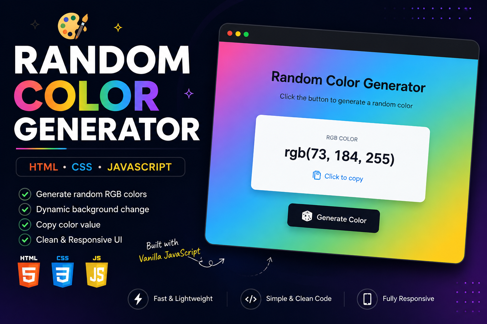

# 🎨 Random Color Generator

A simple and interactive Random Color Generator built using **HTML, CSS, and JavaScript**.

## 🚀 Features

* Generate random RGB colors with a single click
* Dynamically change the background color
* Display the generated RGB color value
* Simple and interactive user interface
* Responsive design

## 🛠️ Technologies Used

* HTML5
* CSS3
* JavaScript

## 💡 What I Learned

Through this project, I practiced:

* JavaScript DOM manipulation
* Event handling
* Random number generation
* Dynamic CSS styling
* Building interactive web interfaces

## 🔗 Live Demo

(https://harshpandey3187.github.io/random-color-generator/)

## 📸 Preview

---

⭐ If you like this project, feel free to star the repository!
